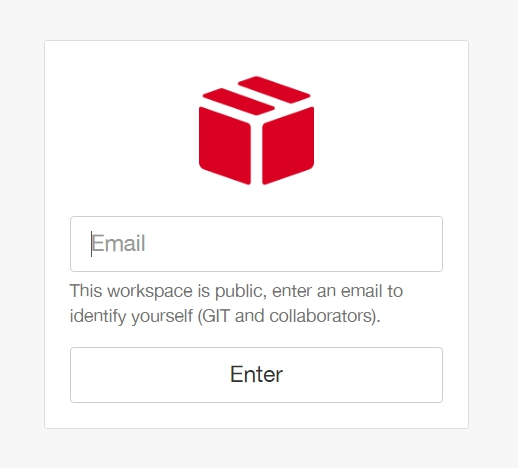
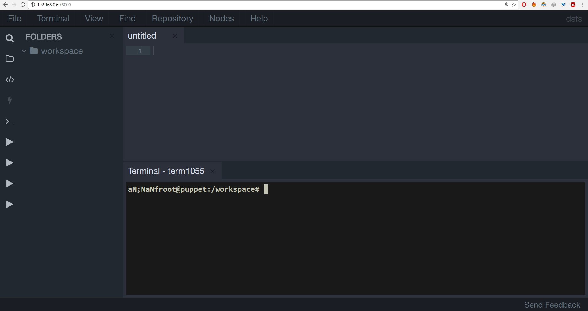

# Codespaces

## How do you use Codespaces IDE in your machine?

### Docker Installation
We assume that you have installed Docker-Engine and Docker-Compose in your machine. If not, please follow the below mentioned references to get started with Docker and Docker-Compose.
  * [Docker-Engine Installation Tutorial](https://docs.docker.com/engine/installation/)
  * [Docker-Compose Installation Tutorial](https://docs.docker.com/compose/install/)

### Start Codespaces IDE

After installing Docker-Engine and Docker-Compose, change directory into the corresponding tool you want to learn. For example, let us assume that you want to learn puppet. In that case,

```
cd cs-xxx
```
where xxx is the codespace you are setting up. 

e.g. 

```
cd cs-ansible
cd cs-chef-ci 
cd cs-puppet-ci
```

Then all you need to do is to run

```
docker-compose up -d
```

This single command will initialize your Codespaces IDE.

### Use Codespaces IDE

To use Codespaces IDE,

  * Open your browser.
  * Visit your machine's IP with port 8000. (Ex. http://192.168.0.60:8080)
  * You will be asked for your e-mail address. Enter it and you are good to go.



  * Now you will be presented with the Codespaces IDE console.




### Resetting a Node 

Since this is a docker based environment, its easy to rest a node. To do that, follow this process, 

 * Find out the name of the node from **docker-compose.yml**


e.g

```
  control:
    image: codespaces/ansible-control:v0.4.0
    ports:
      - "8000:8000"
    volumes:
      - ./code:/workspace
    networks:
      custom:
        ipv4_address: 192.168.61.10
    dns: 8.8.8.8
    domainname: codespaces.io
    hostname: control
    restart: always
  lb:
    image: codespaces/ansible-node-centos-6:v0.3.6
    ports:
       - "80:80"
    networks:
      custom:
        ipv4_address: 192.168.61.11
    dns: 8.8.8.8
    domainname: codespaces.io
    hostname: lb
    restart: always
```

In the above snippet of node, there are two nodes viz **control** and **lb**

You could alternately use the following command to find the node name 

```
docker-compose ps
```

  * Once you decide which node you are resetting, run the following command to redo it. I am taking an example of a node by name **lb**
  
e.g.  
```
docker-compose stop lb 
docker-compose rm lb 
docker-compose up -d lb 
```

Replace the name of actual node with lb.  That should help you redo the node. 
