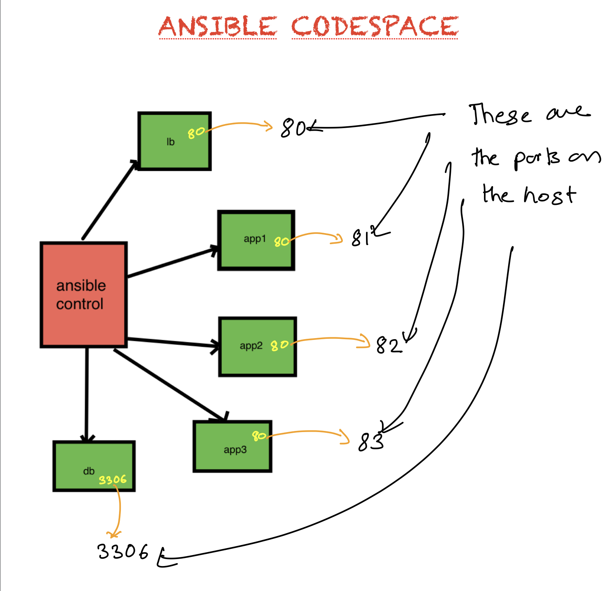

# Setting up  Codespaces IDE for Ansible

After installing Docker-Engine and Docker-Compose, change directory into the corresponding tool you want to setup the environment for.
```
cd cs-ansible
```

Then all you need to do is to run

```
docker-compose up -d
```

This single command will initialize your Codespaces IDE.

## Use Codespaces IDE

To use Codespaces IDE,

  * Open your browser.
  * Visit your machine's IP with port 8000. (Ex. http://192.168.0.60:8000  or http://localhost:8000)


  * Now you will be presented with the Codespaces IDE console.


## Nodes Available





| Containers    | Purpose     | OS | Port Exposed | Host Port Mapped |
| :------------- | :------------- | :------------- | :------------- | :------------- |
| control       | Ansible      | Ubuntu 18.04  | 8000 |  8000 |
| lb       | Load Balancer       | Centos 6.8  | 80 |  80 |
| app1       | App Server       | Centos 6.8 | 80 | 81 |
| app2       |  App Server      | Centos 6.8 | 80 | 82  |
| app3       |  App Server       | Ubuntu 16.04|  80 | 83 |
| db       | Database      | Centos 6.8  | 3306  | 3306 |


## Adding Supporting Code  

To help you with the learning process, we have prepared a git repository with the supporting code. In order to use this code, you need to open a terminal, and clone the code from github as follows,

  * From menu, select **Terminal -> New Terminal**
  * From inside the terminal, use git clone command as demonstrated below 


```
git clone https://github.com/schoolofdevops/ansible-bootcamp-code.git
```

## Managing Environment

Once created, you may want to stop the codespaces environment, or at times might have to recreate it completely, or reset a certain node. This section describes how to do so.

### Stopping codespaces environment

If you would like to stop the environment created earlier, its as simple as the follows,

`run the following from your codespaces directory`

```
cd cs-ansible

docker-compose stop
```

The above command will shut down the containers/bring those to stopped state.  You could easily start it all again, by running the following command from the same directory.

```
cd cs-ansible

docker-compose up -d
```


### Resetting the nodes/environment

Since this is a docker based environment, its easy to rest a node, or even the complete environment.  

To reset a node,

 * Find out the name of the node from **docker-compose.yml**


e.g

```
  control:
    image: codespaces/ansible-control:v0.4.0
    ports:
      - "8000:8000"
    volumes:
      - ./code:/workspace
    networks:
      custom:
        ipv4_address: 192.168.61.10
    dns: 8.8.8.8
    domainname: codespaces.io
    hostname: control
    restart: always
  lb:
    image: codespaces/ansible-node-centos-6:v0.3.6
    ports:
       - "80:80"
    networks:
      custom:
        ipv4_address: 192.168.61.11
    dns: 8.8.8.8
    domainname: codespaces.io
    hostname: lb
    restart: always
```

In the above snippet of node, there are two nodes viz **control** and **lb**

You could alternately use the following command to find the node name

```
docker-compose ps
```

  * Once you decide which node you are resetting, run the following command to redo it. I am taking an example of a node by name **lb**

e.g.  
```
docker-compose stop lb
docker-compose rm lb
docker-compose up -d lb
```

Replace the name of actual node with lb.  That should help you redo the node


To reset the complete environment,

```
docker-compose down
docker-compose up -d  

```

The above command will recreate the nodes, without deleting your workspaces. Any files that you had created would still be available after you re launch the environment.
